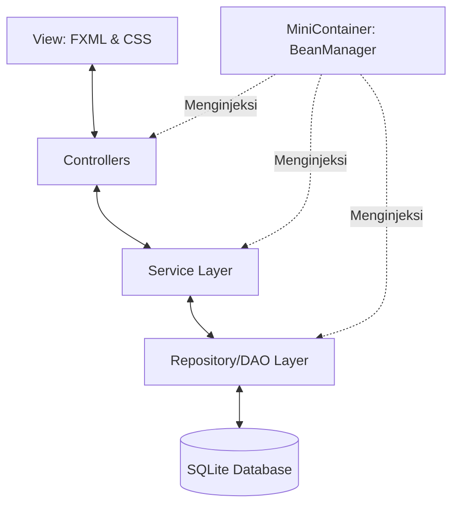

# Kamus FX 📚

**Kamus FX** adalah aplikasi kamus Bahasa Indonesia - Bahasa Inggris berbasis desktop yang dibangun menggunakan **JavaFX 21** dan database **SQLite**. Proyek ini dikembangkan sebagai bagian dari tugas kuliah **Struktur Data (Semester 4)** untuk mendemonstrasikan implementasi struktur data in-memory (seperti `HashMap` untuk translasi cepat) dan konsep arsitektur perangkat lunak yang bersih (Clean Architecture).

Salah satu keunikan proyek ini adalah penggunaan **MiniContainer**, sebuah *dependency injection (IoC) container* mini berbasis refleksi yang dikembangkan sendiri untuk mengatur siklus hidup kelas-kelas service dan repository secara dinamis.

---

## 🚀 Fitur Utama

1. **Autentikasi Pengguna & Keamanan**:
   * Fitur **Login** & **Register** untuk membatasi akses aplikasi.
   * Keamanan kata sandi menggunakan enkripsi **Blowfish Hashing (jBCrypt)** sebelum disimpan ke database.
   * Manajemen sesi aktif menggunakan model `Session` dan log aktivitas pengguna (`UserActivity`).

2. **Pencarian & Translasi Cepat (Quick Search)**:
   * Translasi satu kata dengan performa instan ($O(1)$ kompleksitas waktu) menggunakan cache in-memory `HashMap`.
   * Arah translasi dinamis: **Bahasa Indonesia ➡️ Bahasa Inggris** atau **Bahasa Inggris ➡️ Bahasa Indonesia** yang dapat dipilih via *toggle button*.

3. **Penerjemah Kalimat (Sentence Translator)**:
   * Modul terpisah di panel utama untuk menerjemahkan teks panjang atau kalimat lengkap.

4. **Desain UI/UX Modern**:
   * Desain minimalis dan bersih dengan latar belakang gradasi warna biru (`#4a90e2` ke `#145DA0`).
   * Transisi antarmuka yang mulus menggunakan `SceneManager` terpusat.
   * Efek bayangan (*drop shadow*) dan sudut melengkung (*border radius*) untuk memberikan kesan premium.

5. **MiniContainer (Custom Dependency Injection)**:
   * Mengeliminasi pembuatan objek manual (`new`) dan mendukung *Constructor-based Dependency Injection*.
   * Menggunakan refleksi (`org.reflections`) untuk mendeteksi anotasi `@Auto` secara dinamis.
   * Memiliki sistem deteksi ketergantungan melingkar (*Circular Dependency Detection*).

---

## 📁 Struktur Direktori

Berikut adalah pohon direktori utama dari kode sumber Kamus FX:

```text
kamus-fx/
├── src/
│   ├── main/
│   │   ├── java/
│   │   │   ├── io/github/kamusfx/
│   │   │   │   ├── MiniContainer/       # Custom Dependency Injection Framework
│   │   │   │   │   ├── AppRunner.java
│   │   │   │   │   ├── Auto.java        # Anotasi untuk auto-wiring class
│   │   │   │   │   ├── BeanManager.java # Pengelola siklus hidup Bean & scan package
│   │   │   │   │   ├── Run.java         # Anotasi untuk menentukan entry point
│   │   │   │   │   └── RunnableApp.java
│   │   │   │   │
│   │   │   │   ├── controller/          # JavaFX Controllers (Logika UI)
│   │   │   │   │   ├── HomeController.java
│   │   │   │   │   ├── LoginController.java
│   │   │   │   │   └── RegisterController.java
│   │   │   │   │
│   │   │   │   ├── model/               # Model Objek Data (POJO)
│   │   │   │   │   ├── Session.java
│   │   │   │   │   ├── User.java
│   │   │   │   │   ├── UserActivity.java
│   │   │   │   │   └── Word.java
│   │   │   │   │
│   │   │   │   ├── repository/          # Data Access Object (DAO) & Koneksi DB
│   │   │   │   │   ├── Dictionary/
│   │   │   │   │   │   ├── DictionaryQuery.java
│   │   │   │   │   │   └── DictionaryRepository.java
│   │   │   │   │   ├── User/
│   │   │   │   │   │   ├── UserQuery.java
│   │   │   │   │   │   └── UserRepository.java
│   │   │   │   │   └── SqliteDatabaseImp.java
│   │   │   │   │
│   │   │   │   ├── service/             # Business Logic Layer
│   │   │   │   │   ├── implementation/
│   │   │   │   │   │   ├── AuthService.java
│   │   │   │   │   │   ├── DictionaryServiceImp.java
│   │   │   │   │   │   └── UserServiceImp.java
│   │   │   │   │   ├── DictionaryService.java
│   │   │   │   │   ├── PassswordService.java
│   │   │   │   │   └── UserService.java
│   │   │   │   │
│   │   │   │   ├── view/                # Navigation & View Helpers
│   │   │   │   │   ├── FxmlPath.java
│   │   │   │   │   └── SceneManager.java
│   │   │   │   │
│   │   │   │   ├── Application.java     # Bootstrapper JavaFX App
│   │   │   │   └── Launcher.java        # Entry Point Utama (tanpa modul JavaFX)
│   │   │   │
│   │   │   └── module-info.java         # Modul deklarasi Java 9+ (JavaFX, SQL, dll)
│   │   │
│   │   └── resources/                   # Aset Non-Java (FXML, CSS, Database)
│   │       ├── Data/
│   │       │   └── dictionary           # Database SQLite
│   │       └── io/github/kamusfx/
│   │           ├── css/
│   │           │   └── auth-style.css   # Styling halaman login/register
│   │           └── fxml/
│   │               ├── Home.fxml        # Halaman utama translasi
│   │               ├── Login.fxml       # Halaman login
│   │               └── Register.fxml    # Halaman registrasi
│   │
│   └── test/                            # Unit Testing (JUnit 5)
├── pom.xml                              # Dependensi Maven & Konfigurasi Build
└── README.md                            # Dokumentasi Proyek
```

---

## 🛠️ Arsitektur Sistem

Aplikasi ini menggunakan pola arsitektur **MVC (Model-View-Controller)** yang terpisah dengan jelas melalui layer-layer berikut:



### Penjelasan Komponen:
1. **View**: Dibangun dengan file FXML dan distyling dengan CSS. Berfungsi murni sebagai presentasi antarmuka.
2. **Controller**: Menangani event handler dari View (seperti klik tombol atau enter field) dan meneruskan tugas ke Service Layer.
3. **Service Layer**: Mengandung logika bisnis utama, seperti pencocokan password terenkripsi atau pemformatan teks terjemahan.
4. **Repository Layer**: Menjalankan kueri SQL mentah melalui JDBC ke database SQLite untuk mengambil atau menyimpan entitas.
5. **MiniContainer**: Membaca anotasi `@Auto`, memetakan dependensi konstruktor dari controller/service/repository, lalu menginstansiasi serta mendistribusikan *instance* bean tersebut secara otomatis.

---

## ⚙️ Cara Kerja MiniContainer (Dependency Injection)

Untuk mempermudah manajemen ketergantungan antar-kelas, proyek ini mengimplementasikan Dependency Injection Container sendiri secara internal:

* **Pendaftaran Bean**: Menambahkan anotasi `@Auto` pada kelas yang ingin dikelola daur hidupnya oleh kontainer.
* **Penggunaan**:
  ```java
  @Auto
  @RequiredArgsConstructor // Lombok membuat konstruktor dengan field final
  public class DictionaryServiceImp implements DictionaryService {
      private final DictionaryRepository dictionaryRepository; // Otomatis terinjeksi
  }
  ```
* **Cara Kerja Internal**:
  1. `BeanManager` melakukan scanning pada package `io.github.kamusfx` menggunakan pustaka `reflections`.
  2. Menemukan kelas-kelas yang dianotasikan dengan `@Auto`.
  3. Memeriksa parameter konstruktor kelas tersebut.
  4. Secara rekursif mencari instansiasi parameter tersebut di dalam kontainer atau menginstansiasinya terlebih dahulu jika belum dibuat.
  5. Melakukan validasi *circular dependency* dengan melacak status inisialisasi bean menggunakan `Set<Class<?>> creating`.

---

## 💻 Teknologi yang Digunakan

* **Bahasa Pemrograman**: Java 21
* **Framework GUI**: JavaFX 21.0.6 (javafx-controls, javafx-fxml)
* **Database**: SQLite (menggunakan Driver `org.xerial:sqlite-jdbc`)
* **Keamanan**: jBCrypt (untuk hashing password menggunakan BCrypt algorithm)
* **Metadata & DI Scan**: Reflections library (`org.reflections`)
* **Boilerplate Reduction**: Project Lombok
* **UI Controls**: ControlsFX & BootstrapFX
* **Build System**: Apache Maven 3

---

## 🔧 Persyaratan Sistem & Instalasi

### Prasyarat
Pastikan Anda sudah menginstal perkakas berikut pada mesin Anda:
* **Java Development Kit (JDK) 21** atau versi yang lebih tinggi.
* **Apache Maven** 3.8+.

### Cara Menjalankan Aplikasi
1. Unduh atau salin (*clone*) repositori ini ke komputer lokal Anda.
2. Masuk ke direktori proyek:
   ```bash
   cd kamus-fx
   ```
3. Kompilasi kode sumber dan jalankan aplikasi JavaFX menggunakan plugin Maven:
   ```bash
   mvn clean compile javafx:run
   ```

---

## 📝 Catatan Tambahan (Struktur Data)
Aplikasi ini memanfaatkan struktur data **`HashMap`** bawaan Java untuk pencarian translasi kata. Ketika aplikasi pertama kali berjalan atau setelah login sukses, data kamus dari SQLite akan langsung dibaca dan dimuat sepenuhnya ke dalam memori (*eager loading*). 
* Memuat seluruh kosakata ke `HashMap<String, String>` (satu untuk ID-EN dan satu untuk EN-ID) menghasilkan pencarian terjemahan kata yang sangat efisien dengan waktu konstan **$O(1)$**, meminimalkan kueri I/O database berulang kali selama translasi cepat berlangsung.
# kamus-fx
